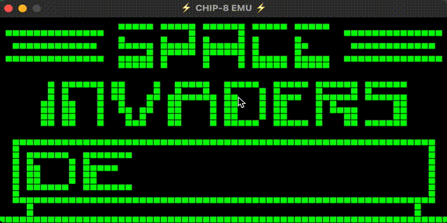

# CHIP-8 emulator

Since I had a little spare time on my hands, I decided to try my hand at building an emulator of a relatively simple system, the CHIP-8.

According to [Wikipedia](https://en.wikipedia.org/wiki/CHIP-8) the CHIP-8 is..

> _"..an interpreted programming language, developed by Joseph Weisbecker. It was initially used on the COSMAC VIP and Telmac 1800 8-bit microcomputers in the mid-1970s. CHIP-8 programs are run on a CHIP-8 virtual machine.."_

This CHIP-8 emulator written was written in C, uses Simple DirectMedia Layer 2.0.16 and is anything but feature complete. It is capable of running CHIP-8 games and passed an OpCode test ROM.

Running CHIP-8 games is simple enough, just pass in the path to your ROM file.

```shell
./chip8emu ./roms/INVADERS
```



## Resources

- [SDL Wiki](https://wiki.libsdl.org)
- [Cowgod's Chip-8 Technical Reference v1.0](http://devernay.free.fr/hacks/chip8/C8TECH10.HTM)
- [C data types](https://en.wikipedia.org/wiki/C_data_types)